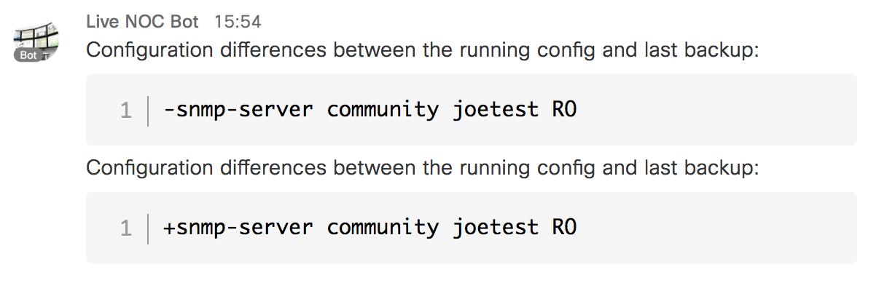

# EEM: Config Diff to Cisco Spark

An EEM+Python policy that pushes config change diffs to Spark.



## Setup

This script requires the IOS-XE _guestshell_ feature.  To enable guestshell, configure:

   ```
   iox
   ```

Then type the following in `EXEC` mode:

   ```
   guestshell enable
   ```

Guestshell may not include the needed `requests` module.  Enter guestshell with the following command:

   ```
   guestshell
   ```

From the guestshell prompt, run the following command:

   ```
   sudo pip install requests
   ```

If this returns an error about not being able to establish a connection to download the module, you
may need to update your DNS settings within guestshell.  If you know your DNS server, you can use
that address.  If you don't, just use 8.8.8.8.  Run the command:

   ```
   sudo echo 'nameserver DNSSERVER' > /etc/resolv.conf
   ```

Where DNSSERVER is the IP address of your DNS server (or 8.8.8.8).  After doing that, repeat
the `pip` command, and it should install successfully.  If `pip` tells you `requests` is already
installed, then your guestshell environment is good.  You can type `exit` to return to IOS-XE.

**NOTE** The guestshell environment will persist across reboots.  It will not revert to the default
state unless you do a `guestshell destory` followed by another `guestshell enable`.

Next, define the following EEM environment. Be sure **NOT** to put quotes around the variable
values:

* `spark_token` : Bearer token for your Spark user/bot
* `spark_room`  : Spark room name to which messages will be sent

    ```
    event manager environment spark_token Bearer 1234abd...
    event manager environment spark_room Network Operators
    ```
Once the environment variables have been defined, copy the script to the EEM user policy
directory.  If you have not defined an EEM user policy directory yet, a good choice is
to create a directory called `flash:/policies` in which to store EEM policies.  Once
the directory has been created, configure:

   ```
   event manager directory user policy flash:policies
   ```

Once your policy has been copied into that directory, register it with the following
command:

   ```
   event manager policy sl_config_diff_to_spark.py
   ```

Once configuration changes start to happen, check your specified Spark room for updates.
